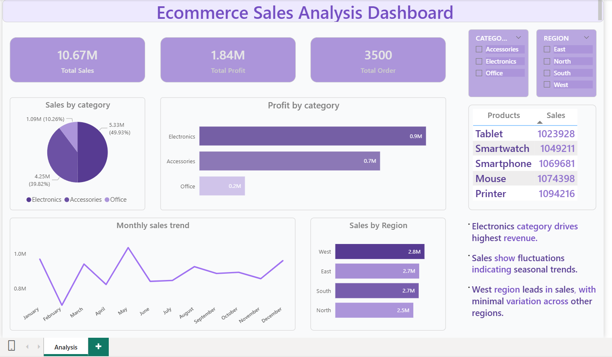

# 📊 Ecommerce Sales Analysis Dashboard

## 🔍 Project Overview

This project analyzes ecommerce sales data using SQL and Power BI to derive business insights.

## 🛠 Tools Used

* SQL (MySQL)
* Power BI

## 📈 Key Insights

* Electronics category drives highest revenue
* Sales show seasonal trends across months
* West region leads in sales with minimal variation across regions

## 🗄 SQL Analysis
Performed SQL queries to extract insights including sales trends, category performance, and regional analysis.

## 📊 Dashboard Preview

## 🔗 Features

* Interactive dashboard
* Category and region filters
* Sales, profit, and trend analysis

## 🚀 How to Use

1. Open the `.pbix` file in Power BI
2. Explore the dashboard using filters
